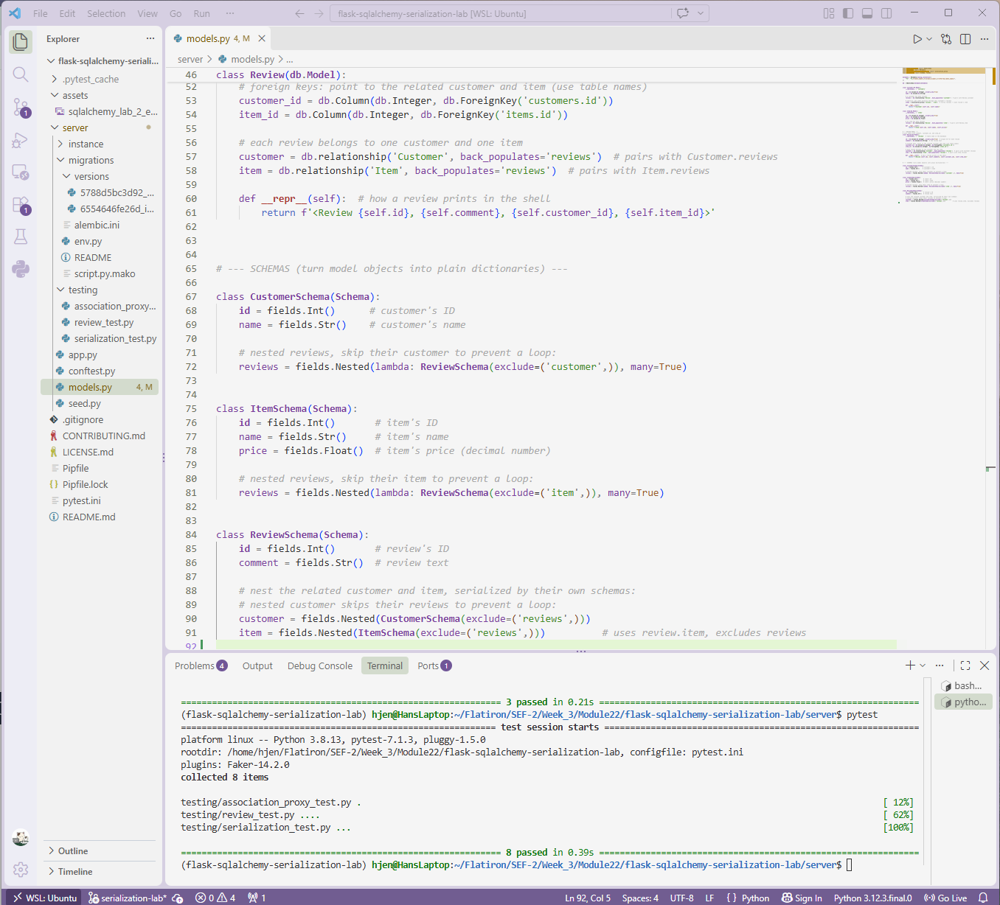

# Lab: Flask-SQLAlchemy Serialization
**Completed Sept 23, 2026** 

## Description
A simplified e-commerce backend built with Flask, SQLAlchemy, and Marshmallow.
It models customers, the items they buy, and the reviews they leave, then
serializes that relational data into nested, JSON-ready dictionaries.



## Features

- **`Review` model** that joins customers and items, with a comment and
  foreign keys to both tables.
- **Two-way relationships** using `back_populates`, so you can move between
  related objects (`review.customer`, `customer.reviews`, `item.reviews`).
- **Association proxy** on `Customer`, so `customer.items` returns every item
  a customer has reviewed without looping through their reviews.
- **Marshmallow schemas** (`CustomerSchema`, `ItemSchema`, `ReviewSchema`)
  that serialize each model, including nested relationships.
- **Recursion protection** using `exclude`, so nested objects never point back
  to their parent and cause an infinite loop.

## Data Model

- A customer **has many** reviews.
- An item **has many** reviews.
- A review **belongs to** one customer and one item.
- A customer **has many** items **through** reviews.

## Installation

Requires Python 3.8 and pipenv.

```
git clone https://github.com/hanjennings1/flask-sqlalchemy-serialization-lab.git
cd flask-sqlalchemy-serialization-lab
pipenv install
pipenv shell
cd server
```

Build the database and add sample data:

```
flask db upgrade head
python seed.py
```

## Usage

Open the Flask shell from the `server` directory:

```
flask shell
```

Then try:

```python
from models import *

customer = Customer.query.first()
customer.items                      # items reviewed by this customer
CustomerSchema().dump(customer)     # customer with nested reviews and items
ItemSchema().dump(Item.query.first())
ReviewSchema().dump(Review.query.first())
```

Example output for a review:

```python
{'id': 1, 'comment': 'zipper broke the first week',
 'customer': {'id': 1, 'name': 'Tal Yuri'},
 'item': {'id': 1, 'name': 'Laptop Backpack', 'price': 49.99}}
```

## Running Tests

From the `server` directory:

```
pytest
```

All 8 tests should pass (review model, association proxy, and serialization).

**Note:** running the tests clears the tables in the local database. To
explore the data in the Flask shell afterward, rebuild and reseed it:

```
rm instance/app.db
flask db upgrade head
python seed.py
```

## Technologies Used

- Python 3.8
- Flask and Flask-Migrate
- Flask-SQLAlchemy
- Marshmallow
- pytest